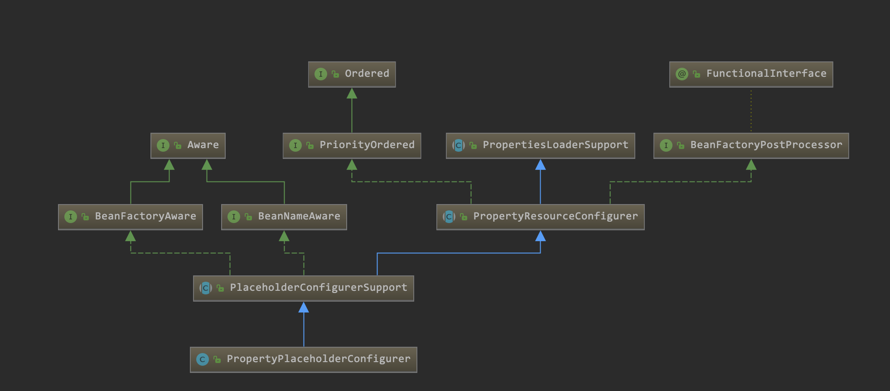
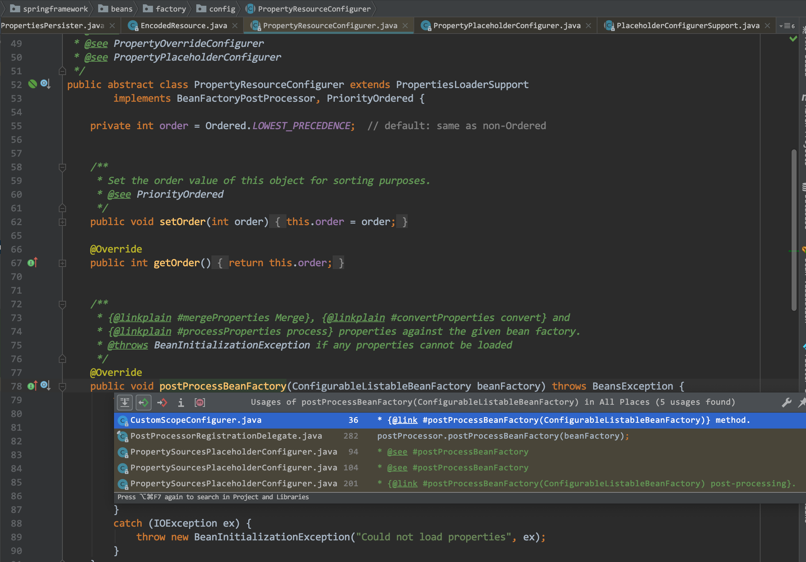
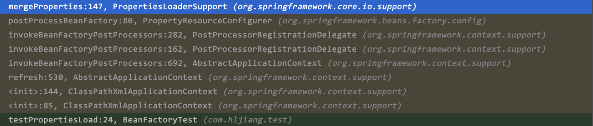
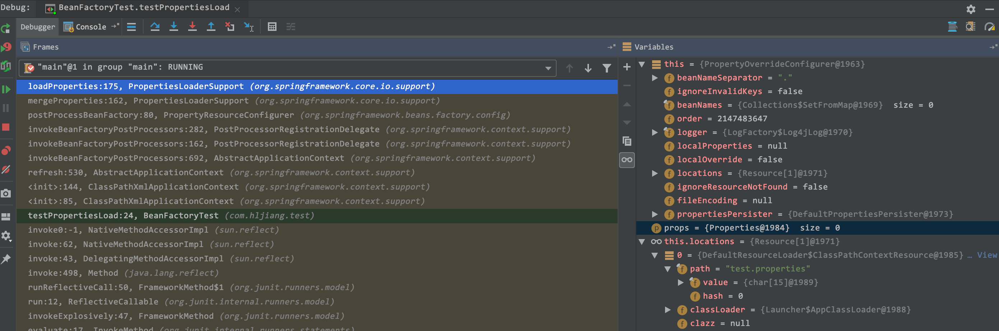
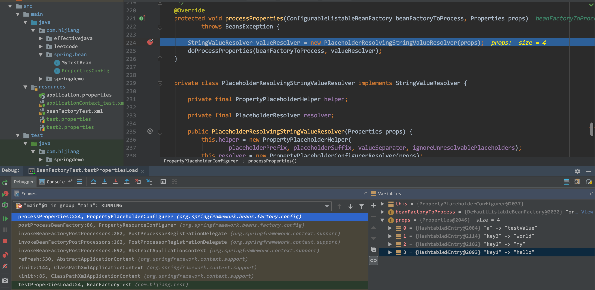
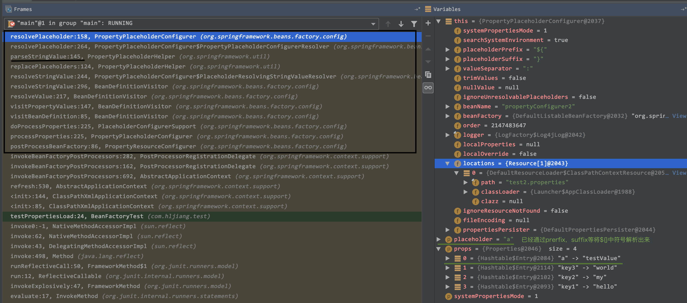

## Spring_Source_Code_Read
### 1、property 解析

```
1、在PropertyPlaceholderBeanDefinitionParser的父类中shouldGenerateId返回true
    1.1 即默认会为每一个bean生成一个唯一的名字
    1.2 如果使用了两个<context:property-placeholder则注册了两个PropertySourcesPlaceholderConfigurer Bean
    1.3 所以不是覆盖（而且bean如果同名是后边的bean定义覆盖前边的）
2、PropertySourcesPlaceholderConfigurer本质是一个BeanFactoryPostProcessor
    2.1 spring实施时如果发现这个bean实现了Ordered，则按照顺序执行；默认无序；
3、此时如果给<context:property-placeholder加order属性，则会反应出顺序
    3.1 order值越小优先级越高即越早执行；
example:
   <context:property-placeholder order="2" location="classpath*:com/zyc/jdbc.properties"/> 
   <context:property-placeholder order="1" location="classpath*:com/zyc/jdbc1.properties"/>
此时会先扫描order='1' 的，如果value没在1中找到，会抛出异常，如果忽略异常，会继续扫描order='2'的继续查找
4、默认情况下ignore-unresolvable；即如果没找到的情况是否抛出异常。默认false：即抛出异常；
<context:property-placeholder location="classpath*:conf/conf_a.properties" ignore-unresolvable="false"/> 
```

#### 1.1 PropertyPlaceeholderConfigurer

```
// 在beanDefinition中尝试用已知配置来替代拥有${...}占位符的property
@Override
protected void processProperties(ConfigurableListableBeanFactory beanFactoryToProcess, Properties props) throws BeansException {
	StringValueResolver valueResolver = new PlaceholderResolvingStringValueResolver(props);
	doProcessProperties(beanFactoryToProcess, valueResolver);
}
```

##### 1) PlaceholderConfigurerSupport
 
```
public abstract class PlaceholderConfigurerSupport extends PropertyResourceConfigurer
		implements BeanNameAware, BeanFactoryAware{....}
// 两种占位符写法，一种是注解，一种是xml直接配置
<bean id="dataSource" 
class="org.springframework.jdbc.datasource.DriverManagerDataSource"/>
    <property name="driverClassName" value="${driver}"/>
    <property name="url" value="jdbc:${dbname}"/>
</bean>
@Value("${person.age}")
-> org.springframework.beans.factory.annotation.Value
```
> 可以定义多个configurers，可以拥有自己的placeholder syntax，其中涉及到ignoreUnresolvablePlaceholders属性，如果一个Configurer管理的properties中，解析Placeholder失败，默认是会抛出异常，如果是true，会忽略异常，然后继续下一个configurer里查找

```
PlaceholderConfigurerSupport中就定义了基本的占位符格式，perfix-> ${，suffix -> }，分隔符-> :
<property name="url" value="jdbc:${dbname:defaultdb}"/>
spring会找到placeholder根据：来进行split，:后面是默认值
```
 
#### 1.2 PropertyOverrideConfigurer 允许设定默认值，然后重写property的value

```
@See PropertyOverrideConfigurer --> beanName.property=value 
//beanName 是属性占位符企图覆盖的bean 名， property 是企图覆盖的属性名
public class PropertyOverrideConfigurer extends PropertyResourceConfigurer
----------------------------------------------------------
Example properties file:
    dataSource.driverClassName=com.mysql.jdbc.Driver
    dataSource.url=jdbc:mysql:mydb
----------------------------------------------------------
<!-- 配置一个属性占位符能自动识别PropertyPlaceholderConfigurer bean --> 
	<bean id="propertyOverrider"  class= "org.springframework.beans.factory.config.PropertyOverrideConfigurer"> 
	    <property name="locations"> 
	        <list> 
	           <value>dbconn.properties</value> 
	           <!--如果有多个属性文件，依次在下面列出来 -->
	       </list> 
	   </property> 
	</bean> 
	
	<!-- 配置本地的DBCP 数据源 -->
	<bean id="dataSource" class="org.springframework.jdbc.datasource.DriverManagerDataSource" destroy-method="close">
	    <property name="driverClassName" value="test"/> // 该属性可以被覆盖
	    <property name="url" value="test"/>  // 该属性也可以被覆盖，根据example
	    <property name="username" value="dd"/> 
	    <property name="password" value="dd"/> 
	</bean>
```

#### 1.3 PropertySourcesPlaceholderConfigurer
 
```
public class PropertySourcesPlaceholderConfigurer extends PlaceholderConfigurerSupport implements EnvironmentAware {...}
// 可以替代PropertyPlaceeholderConfigurer
PropertyPlaceholderConfigurer这个类是把所有的属性集中放到Properties中；
PropertySourcesPlaceholderConfigurer:
1.该类有一个PropertySources的集合;
2.集合中放的是PropertySource，它是一个抽象类，
3.getProperty方法交由子类实现；
4.每一个PropertySource可以是一个Properties
5.而且PropertySource可以是任何东西；例如：System.getProperteis 、System.getenv
```

PropertySourcesPlaceholderConfigurer类直接重写了postProcessBeanFactory方法，如果PropertySources集合为空，此类会把Environment、Properties文件、localProperties放到集合中；


#### 1.4 示例代码

```
    @Test
    public void testPropertiesLoad(){
        ApplicationContext context = new ClassPathXmlApplicationContext("classpath:applicationContext_test.xml");
        PropertiesConfig bean = (PropertiesConfig) context.getBean("propertiesConfig");
        System.out.println("testValue:" + bean.getTestValue());
        .....
    }
    
    public class PropertiesConfig {
        private String testValue;
        private String testValue2ForOverride;
        private String valueNoAnnotate;
        private String valueNoAnnotateForDefault;
        private String placeHolders;
    .......
}
<bean id="propertyConfigurer1"  class="org.springframework.beans.factory.config.PropertyOverrideConfigurer">
        <property name="locations">
                <value>test.properties</value>
        </property>
</bean>
// 注意受OverridingConfigurer托管的配置文件，需要按照beanName.property的写法配置在文件中
<bean id="propertyConfigurer2"   class="org.springframework.beans.factory.config.PropertyPlaceholderConfigurer">
        <property name="locations">
            <value>test2.properties</value>
        </property>
</bean>

<bean id ="propertiesConfig" class="com.hljiang.spring.bean.PropertiesConfig">
    <property name="testValue" value="aa"></property>
    <property name="testValue2ForOverride" value="aa"></property>
    <property name="valueNoAnnotate" value="${a}"></property>
    <property name="valueNoAnnotateForDefault" value="${b:100}"></property>
    <property name="placeHolders" value="${key1}${key2}${key3}"></property>
</bean> 

```
#### 1.5 propertyConfigurer 结构


- 图中可以看出其实Configurer是一个Bean的预处理器，在创建bean的时候可以调用预处理方法，继续查找引用

> `abstract class PropertyResourceConfigurer extends PropertiesLoaderSupport
		implements BeanFactoryPostProcessor, PriorityOrdered `
		

> 观察引用方-> postProcessorRegistrationDelegate.java中调用了该处理器；
> 发现跳到AbstractApplicationContext类中；
> 而AbstractApplicationContext是所有实现ApplicationContext子类的抽象父类；
> AbstractApplicationContext.invokeBeanFactoryPostProcessors

- 补充说明：
`插入idea mac 快捷键： option+command+b -> find implements;
command+option+左箭头  退回到上一个操作
shift+command+4 system 截图
option+F7 查看usage
command + o 查找类
option + Enter`
		
- 处理props，processProperties()
	
```	
// 实现了这个预处理器，在方法里处理properties
// 1、合并props 2、convertProps 3、processProperties
@Override
public void postProcessBeanFactory(...){}
    // 需要判断isOverride
    // 如果localProperties可能需要进行mergeInto
    propertiesLoaderSupport.loadProperties(Properties props){
}
```
- debug 下调用路径，和1.5中介绍一致propertiesLoaderSupport.mergeProperties

- propertiesLoaderSupport.loadProperties

可以看出来先扫描的xml中第一个配置的OverridingConfigurer的托管配置，load之后将properties中配置就解析成Key和Value对的形式，实际上HashTable的内存对象

```
propertiesLoaderSupport.loadProperties
    -> PropertiesLoaderUtils.fillProperties
    -> DefaultPropertiesPersister.load(props, stream)
    // 从文件流中获取文件并解析载入到Properties的props里返回；
    // 具体解析placeholders同时操作内存交与StringResolver、BeanVistor
    // 以上在具体的Configurer类里定义private class
    ---> Properties.load(Stream in); 是一个synchorized method;
    load中根据byte遍历，会对\t \\ \f以及= ： 这种特殊字符处理；
    并以此将key=value对应的index解析出，然后in.read(index)类似这种转成string存储
    class Properties extends Hashtable<Object,Object>
```
- 占位符placeholder处理

- BeanVistor和StringResolver

